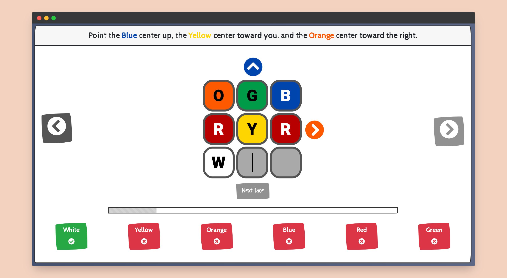

# CubeSolver

[Live Demo](https://lit-wildwood-85517.herokuapp.com/) (Takes a few seconds to load)

Never peel the stickers off your Rubix Cube again - solve it in under two minutes with this tool!

### Usage

Enter your cube into the user-friendly interface by following the instructions on orientation. There are also arrows around the cube to help direct you! Once you've entered a complete cube, instructions on how to solve the cube appear below. You can choose between two modes: Verbose (where everything is fully written out) or Concise (instructions written in standard cubing notation).

### Stack

Front-end was written in React, using Bootstrap/Bootswatch (sketchy theme). Solver is served by a simple express server. 
